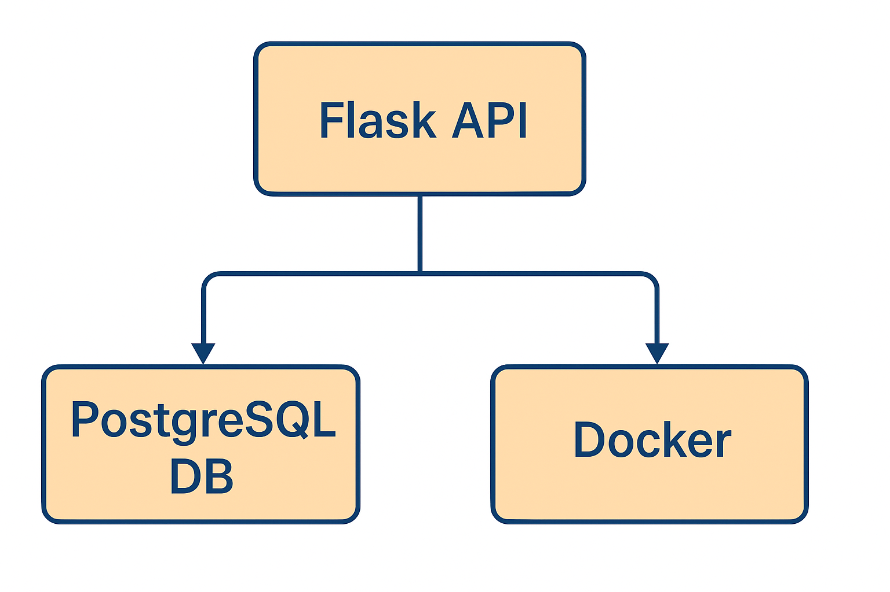
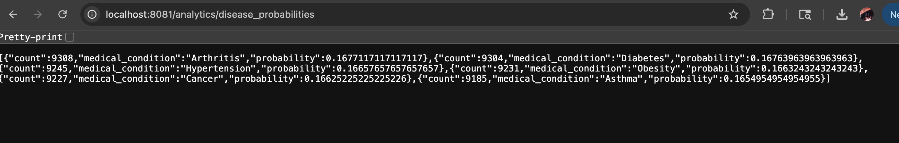
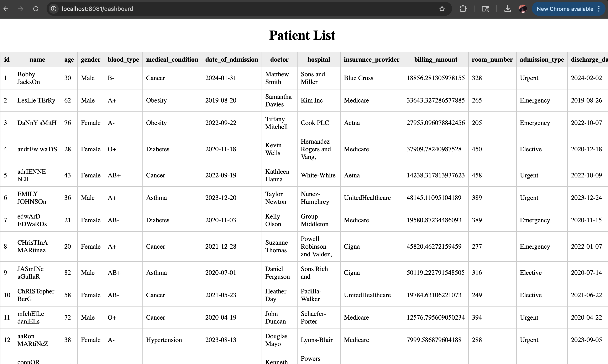
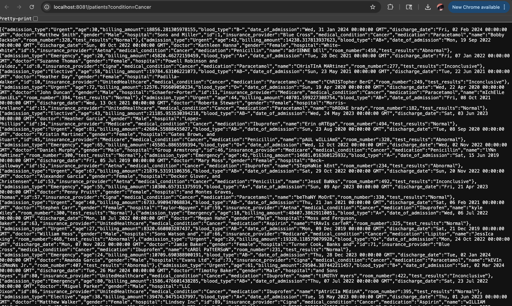

# Healthcare Data API

A containerized PostgreSQL + Flask API for querying and analyzing a healthcare dataset

## 1️⃣ Executive Summary
### Problem

Healthcare datasets are large, messy, and often difficult to search, analyze, or process manually. For students or researchers wanting to explore health patterns — such as conditions, demographics, or billing trends — there needs to be a simple, reproducible tool that exposes this data through clean programmatic access.

### Solution

This project implements a Dockerized Flask API backed by a PostgreSQL database seeded with a real healthcare dataset (~55k records).
It provides:
- A REST API for retrieving patient data
- Filtering by medical condition
- An analytics endpoint for computing disease probabilities
- A simple HTML dashboard for viewing patient entries in a browser
- Fully reproducible environment using Docker Compose + environment variables

This serves as a minimal, functional data pipeline demonstrating SQL, containerization, and API design concepts from the course.

## 2️⃣ System Overview
### Course Concepts Used

- SQL + Relational Schema Design
- Flask API (HTTP routing, JSON responses)
- Containerization with Docker
- Environment variable configuration (.env, .env.example)
- Database seeding via Postgres entrypoint

## Architecture Diagram

### Data / Services Overview
| Component                 | Description                                                   |
| ------------------------- | ------------------------------------------------------------- |
| **Dataset**               | `healthcare_dataset.csv` (~55,500 rows)                       |
| **Database**              | PostgreSQL 15 running in a Docker container                   |
| **Backend API**           | Flask app exposing `/patients`, `/analytics/…`, `/dashboard`  |
| **Containerization**      | Dockerfile for Flask API, Compose for both services           |
| **Environment Variables** | Loaded via `.env` (not committed), `.env.example` (committed) |

## 3️⃣ How to Run (Local)
**Requirements**
- Docker Desktop installed
- .env file in project root (copied from .env.example)
- Dataset present at db/healthcare_dataset.csv

1. Copy the environment template
cp .env.example .env

2. Build and run the stack
docker compose up --build

3. API Health Check
curl http://localhost:8081/health

**Available Endpoints**
1. All patients
GET /patients

2. Filter by condition
GET /patients?condition=Cancer

3. Disease probability analytics
GET /analytics/disease_probabilities

Returns:

[
  {"medical_condition": "Diabetes", "count": 8250, "probability": 0.148}
]

4. HTML Dashboard
Visit: http://localhost:8081/dashboard

## 4️⃣ Design Decisions
**Why SQL?**
- Healthcare datasets are relational by nature
- Enables fast queries on large datasets
- Natural fit for structured patient records

**Why Docker?**
- Guarantees reproducibility
- Eliminates “works on my machine” issues
- Produces a one-command setup for graders and classmates

**Tradeoffs**
- Loading the full CSV on startup takes time
- Probabilities are computed on-demand (not cached)
- Analytics kept simple to stay within project scope

**Security & Privacy**
- No real patient data (open-source synthetic dataset)
- .env file stores database config securely
- .env is not committed to GitHub
- Example template .env.example is provided

**Operations (Ops)**
- Database initialized via seed.sql
- All services attached by Docker internal networking
- Container logs show startup, queries, and API hits

## 5️⃣ Results & Evaluation
**Functional Highlights**
- Database successfully seeded with 55,500 rows
- API returns JSON responses quickly and reliably
- Filtering and analytics endpoints work as expected
- HTML dashboard provides a readable, fast UI

## Screenshots (to show a few)

### Probability Endpoint Example

### Dashboard Table View

### Filter by Condition Example

## 6️⃣ What’s Next (Future Improvements)
**Potential enhancements:**
- Joint probabilities (e.g., P(Diabetes AND Female))
- Visualization endpoints (charts generated via Matplotlib)
- Deploying to Render/Azure for public access (+Extra Credit)

## 7️⃣ Links
GitHub Repo: Add your repo link here.
Cloud Deployment: Not deployed.

## Credits
**Dataset: “Healthcare Dataset” sourced from Kaggle (synthetic sample used for educational purposes).**
**Link:** https://www.kaggle.com
**License: MIT License (see LICENSE file).**
